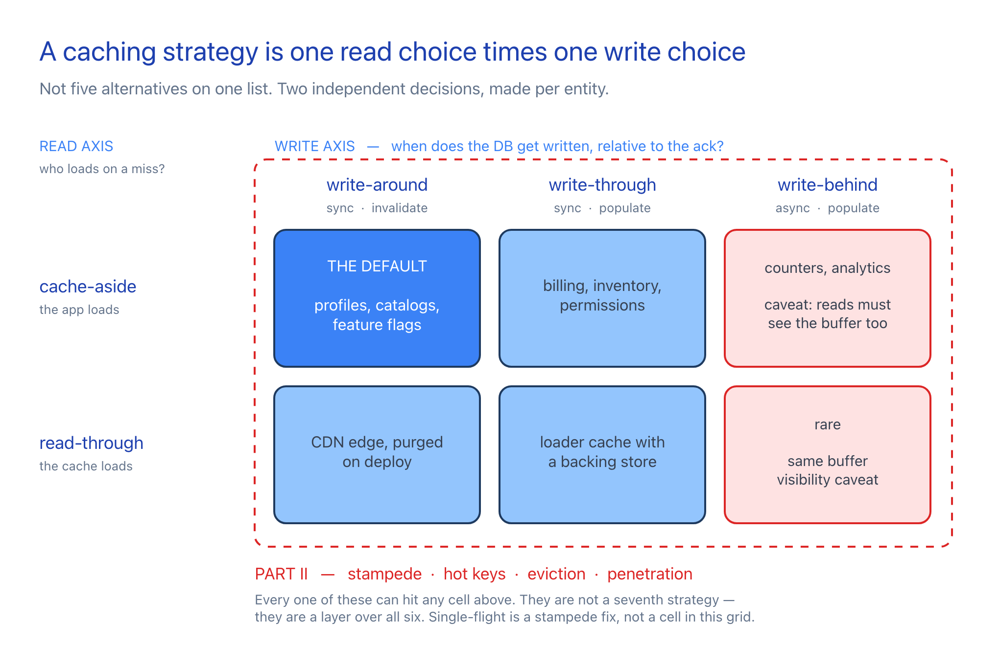
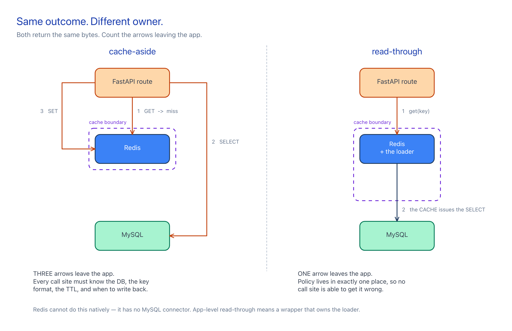
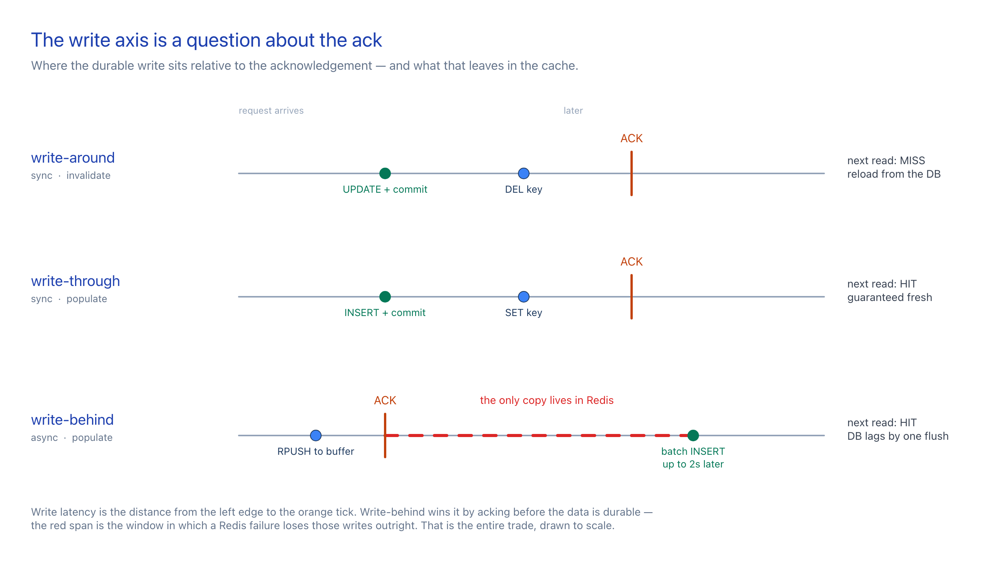
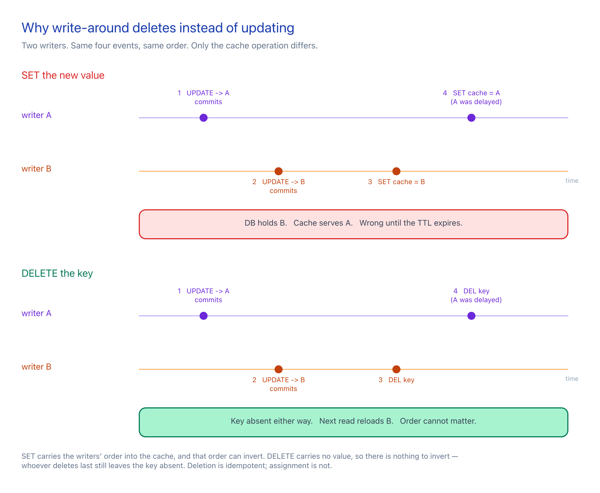
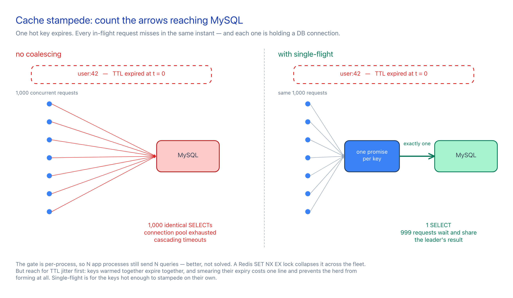

# Caching Strategies for System Design

Beyond cache-aside: the read/write strategy matrix, and the failure modes that bite you regardless of which cell you pick.

Examples are **pseudo-code shaped like FastAPI + MySQL + Redis** — real route decorators, real Redis commands, real SQL, with the plumbing stripped out so the caching decision stays visible.

---

## Table of Contents

**Part I — Strategies: who owns the path**

1. [The Two Axes](#1-the-two-axes)
2. [Cache-Aside (Lazy Loading)](#2-cache-aside-lazy-loading) — *read*
3. [Read-Through](#3-read-through) — *read*
4. [Write-Through](#4-write-through) — *write*
5. [Write-Behind (Write-Back)](#5-write-behind-write-back) — *write*
6. [Write-Around](#6-write-around) — *write*
7. [Combining Them](#7-combining-them)

**Part II — Failure modes: orthogonal to strategy choice**

8. [Cache Stampede / Thundering Herd](#8-cache-stampede--thundering-herd)
9. [Hot Keys](#9-hot-keys)
10. [Invalidation & Eviction](#10-invalidation--eviction)
11. [Negative Caching](#11-negative-caching)

**Part III — Reference**

12. [Comparison Tables](#12-comparison-tables)
13. [Decision Guide](#13-decision-guide)

---

## Reading the Pseudo-Code

Every example is **pseudo-code**, not runnable Python. It keeps the shape of FastAPI + MySQL + Redis — real route decorators, real Redis commands, real SQL — and drops connection pools, imports, serialization, and error plumbing so the caching decision stays visible.

| Pseudo-call | Real thing underneath |
|---|---|
| `cache.get(k)` / `cache.set(k, v, ttl=n)` | Redis `GET` / `SET k v EX n` |
| `cache.delete(k)` / `cache.exists(k)` | Redis `DEL` / `EXISTS` |
| `cache.set(k, v, nx=True, ex=n)` | Redis `SET k v NX EX n` — atomic lock acquire |
| `cache.rpush` / `lmove` / `ltrim` | Redis list ops, verbatim |
| `db.query(sql, args)` | MySQL `SELECT` — returns a row, or `None` |
| `db.execute(sql, args)` + `db.commit()` | MySQL `INSERT`/`UPDATE`, explicit commit |
| `db.execute_many(sql, rows)` | One multi-row `INSERT` |

Values are shown going into the cache as objects; assume JSON in and out. A runnable demo per strategy lives in `demos/` (coming).

The table used throughout:

```sql
CREATE TABLE users (
  id           BIGINT PRIMARY KEY,
  email        VARCHAR(255) NOT NULL,
  display_name VARCHAR(255) NOT NULL,
  updated_at   TIMESTAMP DEFAULT CURRENT_TIMESTAMP ON UPDATE CURRENT_TIMESTAMP
);
```

---

# Part I — Strategies: who owns the path

## 1. The Two Axes

Caching strategies are usually presented as a flat list, which makes them look like five mutually exclusive options. They aren't. There are **two independent decisions**, and a real system picks one from each column.

**Read axis — who loads from the DB on a miss?**

| Strategy | Loader lives in |
|---|---|
| Cache-aside | The application |
| Read-through | The cache layer |

**Write axis — when does the DB get written, relative to the ack?**

| Strategy | DB write timing | Cache after write |
|---|---|---|
| Write-through | Before the ack, synchronously | Populated |
| Write-behind | After the ack, asynchronously | Populated (it's the source of truth) |
| Write-around | Before the ack, synchronously | Invalidated, not populated |

So "cache-aside" in casual usage usually means **cache-aside reads + write-around writes** — that's the default pairing, and it's why the two get conflated. Naming them separately is what lets you say things like "read-through reads with write-behind writes" without contradiction.

The two axes are orthogonal to a third thing entirely: **what happens when the cache doesn't have the answer and a thousand requests notice at once.** That's Part II. It is not a strategy — it's a failure mode every strategy in Part I shares.



---

## 2. Cache-Aside (Lazy Loading)

> **Read strategy.** The application is the orchestrator.

Check cache → on miss, query DB → write result back into cache. The cache never talks to the database. It is a dumb key-value box that the app happens to consult first.

```
READ:  app → cache (miss) → DB → app writes cache → return
```

<details>
<summary>Cache-aside read path — the app orchestrates</summary>

```python
@app.get("/users/{user_id}")
def get_user(user_id):
    key = f"user:{user_id}"

    hit = cache.get(key)                     # GET user:42
    if hit:
        return hit                           # HIT -- the DB is never touched

    row = db.query("SELECT * FROM users WHERE id = %s", user_id)
    if not row:
        return 404

    cache.set(key, row, ttl=300)             # the app backfills the cache
    return row
```

</details>

The write half of what people call "cache-aside" is [write-around](#6-write-around) — see §6.

**Resilience note:** if Redis is down, every read degrades to a DB query. Slower, but not an outage. That property is worth more than it sounds, and write-behind is the one strategy that gives it up.

> **When to use:** Default read strategy. Read-heavy workloads with tolerable staleness — user profiles, product catalogs, feature flags. Cheap to reason about. Costs one slow request per key per TTL expiry, and is the pattern most exposed to stampedes (§8).

---

## 3. Read-Through

> **Read strategy.** The cache owns the loader.

The application asks the **cache** for a key and stops there. On a miss, the *cache* loads from the database, populates itself, and returns the value. The app has no DB code in its read path at all.



Observable behavior is nearly identical to cache-aside. The difference is **where the loading logic lives**. Read-through centralizes it, so every caller inherits the same TTL, serialization, negative caching, and stampede protection without having to remember any of it.

Redis cannot do this natively — it has no MySQL connector. App-level "read-through" with Redis means a wrapper that owns the loader function:

<details>
<summary>Read-through wrapper — the cache owns the loader</summary>

```python
MISS = "<known-absent>"

class ReadThroughCache:
    """The cache owns the loader. Callers never see the DB."""

    def __init__(self, loader, ttl=300, negative_ttl=30):
        self.loader, self.ttl, self.negative_ttl = loader, ttl, negative_ttl

    def get(self, key):
        hit = cache.get(key)
        if hit is not None:
            return None if hit == MISS else hit

        value = self.loader(key)

        if value is None:
            cache.set(key, MISS, ttl=self.negative_ttl)   # negative cache, see §11
            return None

        cache.set(key, value, ttl=self.ttl)
        return value


# Loading policy -- TTL, negative caching, serialization -- defined once, here.
user_cache = ReadThroughCache(
    loader=lambda key: db.query("SELECT * FROM users WHERE id = %s",
                                key.split(":")[1])
)
```

</details>

<details>
<summary>Route using the read-through cache</summary>

```python
@app.get("/users/{user_id}")
def get_user(user_id):
    return user_cache.get(f"user:{user_id}") or 404
    # note what is absent: no SQL, no TTL, no cache.set. The route
    # cannot get the caching policy wrong, because it has none.
```

</details>

`aiocache`'s `@cached` decorator is essentially this pattern packaged.

### Where read-through actually shines

Application-level Redis rarely needs the ceremony — cache-aside gives the same result with less indirection. The abstraction pays off once you have many cached entities and want one place to enforce policy.

Read-through is the *native* model for infrastructure that sits in front of an origin:

- **CDNs** (CloudFront, Cloudflare, Fastly) — edge miss triggers an origin fetch by the CDN itself.
- **Reverse-proxy caches** (Varnish, nginx `proxy_cache`).
- **Caching libraries with loaders** — Caffeine's `LoadingCache`, Guava, EHCache read-through.
- **Managed caches with backing stores** — DynamoDB DAX, ElastiCache with a data-loading layer.

> **When to use:** When loading policy needs one home across many entities, or when the caching layer is infrastructure you don't control. For a handful of Redis-cached entities in a FastAPI app, plain cache-aside is clearer.

---

## 4. Write-Through

> **Write strategy.** Synchronous DB write, cache populated.

Conceptually, the application writes **only to the cache**, and the cache synchronously persists to the database before acknowledging. Reads therefore always hit a cache that reflects committed state.

All three write strategies share one timeline. §4, §5, and §6 are the three lanes; the orange tick is the ack:



Redis has no native write-through to MySQL, so in practice you implement it in the application's write path: one function that owns "DB commit, then cache update" as a single unit. The important property is not *where the code lives* — it's that no write path exists that touches the DB without also refreshing the cache.

### Ordering: DB first, then cache

Write DB first. The inverse means a DB failure leaves the cache advertising a value that was never persisted — a lie that survives until TTL.

<details>
<summary>Write-through — DB commit, then cache set</summary>

```python
@app.put("/users/{user_id}/settings")
def update_settings(user_id, body):

    # 1. Durable write FIRST. If this raises, nothing was cached --
    #    the cache can never advertise a value the DB rejected.
    db.execute("""
        INSERT INTO users (id, email, display_name) VALUES (%s, %s, %s)
        ON DUPLICATE KEY UPDATE email        = VALUES(email),
                                display_name = VALUES(display_name)
    """, user_id, body.email, body.display_name)
    db.commit()

    # 2. Cache refresh, same request, so the next read is warm.
    try:
        cache.set(f"user:{user_id}", body, ttl=300)
    except CacheUnavailable:
        # The row is already durable. Failing the request now would be a lie.
        # Degrade to invalidation: the next read falls through to the DB.
        cache.delete(f"user:{user_id}")

    return body
```

</details>

### The dual-write consistency risk

Two systems, one logical write, no shared transaction. Three failure shapes:

| Failure | Result | Mitigation |
|---|---|---|
| DB commit fails | Cache untouched, request errors | Correct by construction — DB is written first |
| Cache write fails after DB commit | Cache holds stale value | Fall back to `DELETE`; TTL caps the staleness window |
| Process dies between commit and cache write | Cache holds stale value | Bounded TTL; or drive cache updates from the DB binlog (CDC) |

For hard consistency requirements the durable fix is **not** more careful application code — it's to stop dual-writing. Emit cache updates from MySQL's binlog via Debezium/Maxwell, so the cache becomes a derived view of the committed log rather than a second write target.

Concurrent writers to the same key can also interleave: writer A commits, B commits, B caches, A caches ⇒ cache shows A's older value. Guard with a per-key lock or a version/`updated_at` compare on the cache write if that matters.

> **When to use:** Data where a stale read is a correctness bug, not an annoyance — account settings, billing and financial records, inventory counts, permission checks. You pay full DB write latency plus a cache round-trip, and you cache data that may never be read. Worth it when reads are frequent and staleness is expensive.

---

## 5. Write-Behind (Write-Back)

> **Write strategy.** Asynchronous batched DB write, cache is the source of truth.

The application writes only to the cache and returns immediately. A background worker drains buffered writes into the database in batches.

```
WRITE:  app → cache (ack immediately)
                ↓
          [Redis list/stream buffer]
                ↓  (background worker, batched)
              MySQL
```

Write latency becomes one Redis round-trip. Throughput improves further because N individual `INSERT`s collapse into one multi-row `INSERT` — fewer round-trips, fewer fsyncs, less lock contention.

### Producer: the FastAPI endpoint

<details>
<summary>Write-behind producer — the endpoint</summary>

```python
@app.post("/events", status_code=202)     # 202 Accepted: buffered, NOT durable
def record_event(event):
    pipe = cache.pipeline()
    pipe.rpush("queue:events", event)                        # the write buffer
    pipe.hincrby(f"stats:{event.user_id}", event.name, 1)    # the readable value
    pipe.execute()

    # Both in one round trip. Reads see the new count immediately --
    # the DB still knows nothing about it.
    return {"status": "accepted"}
```

</details>

`202 Accepted` is the honest status code. The write is buffered, not durable.

### Consumer: the flush worker

A separate process — not a FastAPI background task. It must survive independently of the web process.

<details>
<summary>Write-behind consumer — the flush worker</summary>

```python
# A SEPARATE PROCESS. Must outlive any individual web worker.

QUEUE    = "queue:events"
INFLIGHT = "queue:events:inflight"


def claim_batch(limit):
    """LMOVE, not LPOP: a crash before commit must not lose the batch."""
    batch = []
    while len(batch) < limit:
        row = cache.lmove(QUEUE, INFLIGHT, "LEFT", "RIGHT")
        if not row:
            break
        batch.append(row)
    return batch


def recover_inflight():
    """On startup, return whatever a previous crash stranded mid-flush."""
    while cache.lmove(INFLIGHT, QUEUE, "RIGHT", "LEFT"):
        pass


def run():
    recover_inflight()

    while True:
        batch = claim_batch(500)
        if not batch:
            sleep(2)
            continue

        try:
            db.execute_many("""
                INSERT INTO events (user_id, name, value, created_at)
                VALUES (%s, %s, %s, %s)
            """, batch)                       # 500 inserts -> one round trip
            db.commit()
            cache.ltrim(INFLIGHT, len(batch), -1)     # ack: drop what we wrote

        except DBError:
            recover_inflight()                # put them back, retry next tick
            sleep(2)
```

</details>

Two details that matter:

- **`LMOVE` to an in-flight list, not `LPOP`.** A plain `LPOP` followed by a crash before `commit()` silently drops the batch. The in-flight list plus `recover_inflight()` gives at-least-once delivery — so make the DB write idempotent (natural key + `INSERT IGNORE` or `ON DUPLICATE KEY UPDATE`) if duplicates would be harmful.
- **Backpressure.** Monitor `LLEN queue:events`. If producers outrun the worker indefinitely, Redis memory grows until eviction or OOM. Alert on queue depth; shed load or scale workers.

### The data-loss risk

The defining tradeoff. It cannot be engineered away, only bounded. Between the ack and the flush, the only copy of the data lives in Redis. If Redis dies in that window, those writes are gone.

Bounding levers:

- Short flush interval — shrinks the exposure window, at the cost of smaller batches.
- Redis AOF with `appendfsync everysec` — caps loss at ~1s of writes on a Redis process crash, though not on host/disk loss.
- Redis replication + persistence for host-failure survival.
- Redis **Streams** (`XADD` / consumer groups) instead of lists, for per-consumer acknowledgment and replay built in.

There's also a quieter way to lose the buffer that has nothing to do with crashes: **eviction**. See [§10](#10-invalidation--eviction) — a default `maxmemory-policy` will happily delete your queue.

If losing a window of writes is unacceptable, this is the wrong strategy — use write-through.

> **When to use:** High write throughput where individual records are cheap and eventual consistency is fine — metrics, view/click counters, analytics events, audit logs, activity feeds, rate-limit counters. Never for money, orders, or anything a user will notice missing.

---

## 6. Write-Around

> **Write strategy.** Synchronous DB write, cache invalidated rather than populated.

Write straight to the database, then **delete** the cache key. The next read repopulates it through whichever read strategy you're using.

<details>
<summary>Write-around update — commit, then <code>DELETE</code> the key</summary>

```python
@app.put("/users/{user_id}")
def update_user(user_id, display_name):
    db.execute("UPDATE users SET display_name = %s WHERE id = %s",
               display_name, user_id)
    db.commit()

    cache.delete(f"user:{user_id}")    # DELETE, never SET -- see the race below
    return {"id": user_id, "display_name": display_name}
```

</details>

### Why delete instead of update?

Deleting is strictly safer than writing the new value, for a reason that isn't obvious:



Two writers can commit in one order and update the cache in the opposite order, leaving the cache permanently wrong until TTL. A `DELETE` has no such hazard — whoever deletes last still leaves the key absent, and the next read pulls committed state.

The cost: every write throws away a cache entry that might have been reused, so write-heavy keys churn. That's the "around" in write-around — writes route *around* the cache instead of through it.

### The read-modify-write race

`DELETE` fixes concurrent *writers* but not a concurrent reader that's mid-flight:

```
reader:  GET (miss) → SELECT (gets old value) ─────────────→ SET cache=old
writer:                       └─ UPDATE → DELETE cache ─┘
```

The reader's `SET` lands after the writer's `DELETE` and resurrects a stale value. Narrow window, but real under load. Mitigations, in increasing order of effort:

- **TTL** — always set one. Bounds the damage to one TTL regardless of what races.
- **Delayed double delete** — delete, commit, then schedule a second delete a few hundred ms later to sweep up resurrections.
- **CDC from the binlog** — invalidations derive from committed order, so the race can't happen.

> **When to use:** The default write strategy, and the write half of what people call "cache-aside". Right whenever writes are less frequent than reads and you don't need the written value warm immediately. Also the right pick for write-heavy data that's rarely read back — populating the cache there is pure waste.

---

## 7. Combining Them

Pick one read strategy and one write strategy. Most cells are legal; a few are pointless.

| Read ↓ / Write → | **Write-around** | **Write-through** | **Write-behind** |
|---|---|---|---|
| **Cache-aside** | ✅ The default. What "cache-aside" colloquially means. | ✅ Common. Reads lazy, hot writes stay warm. | ⚠️ Reads must consult the buffer too, or they'll miss unflushed writes. |
| **Read-through** | ✅ CDN-typical: origin write, purge the edge. | ✅ Loader-based caches with write-through backing stores. | ⚠️ Same buffer-visibility problem. |

The ⚠️ cells aren't forbidden — they're where write-behind's "cache is the source of truth" claim has to be made literally true. In the §5 example that's what `pipe.hincrby(f"stats:{user_id}", ...)` does: it updates the *readable* cache key in the same pipeline as the queue push, so reads never see a value that's missing the unflushed writes. Skip that and your reads silently lag the flush interval.

### A realistic service uses several at once

Per-entity, not per-application:

<details>
<summary>Per-entity strategy picks</summary>

```python
# Profiles: read-heavy, staleness fine
#   → cache-aside + write-around

# Billing plan: stale read = wrong charge
#   → cache-aside + write-through

# Page-view counters: 50k writes/sec, nobody notices a lost second
#   → write-behind + cache-as-source-of-truth reads

# Static assets: someone else's cache
#   → read-through (CDN) + write-around (purge on deploy)
```

</details>

Choosing one strategy for an entire service is the actual mistake. The unit of choice is the entity.

---

# Part II — Failure modes: orthogonal to strategy choice

Nothing in this part is a caching strategy. These are the things that break *after* you've picked one, and they break the same way in every cell of the matrix above.

## 8. Cache Stampede / Thundering Herd

A hot key expires. In the microseconds before anything repopulates it, every in-flight request misses simultaneously — and every one queries the database.



Also called *dog-piling*. Worst exactly where you'd least like it: your most popular keys, under your heaviest traffic. And self-amplifying — the DB slows down, so requests take longer, so more pile up behind the same miss.

Four mitigations follow, roughly in order of cost. **Do 8.1 always.** Add the others when a single key's load is heavy enough that even a handful of concurrent misses hurts.

### 8.1 TTL jitter

The cheapest fix by a wide margin, and it addresses the most common trigger: keys populated together expire together.

<details>
<summary>TTL jitter — two lines</summary>

```python
cache.set(key, row, ttl=300 + random_between(0, 60))
# Keys warmed together (deploy, batch job, traffic spike) otherwise expire
# together. Jitter smears them so the herd never forms.
```

</details>

A cache warmed by a deploy, a batch job, or a traffic spike has thousands of keys with identical expiry timestamps. Jitter smears them across a window so the herd never forms. Two lines, no coordination, no new failure modes. If you take one thing from Part II, take this.

Jitter does not help a *single* key that's hot enough to stampede on its own — that's what the rest of §8 is for.

### 8.2 Single-flight, in-process (a promise per key)

Exactly one request executes the expensive load; every other request for that key waits and shares the result. Within one Python process, a dict of in-flight futures is enough.

<details>
<summary>In-process coalescing — one promise per key</summary>

```python
inflight = {}      # cache key -> pending result. THIS PROCESS ONLY.

def get_single_flight(key, loader, ttl=300):
    hit = cache.get(key)
    if hit:
        return hit

    if key in inflight:
        return wait_for(inflight[key])   # someone is already loading it

    promise = new_promise()
    inflight[key] = promise
    # Registered before anything can yield -- that is what makes
    # this check-then-set safe without a lock.

    try:
        value = loader()                 # exactly one caller reaches here
        cache.set(key, value, ttl=ttl)
        promise.resolve(value)
        return value

    except ANYTHING as err:              # including cancellation / disconnect
        promise.reject(err)              # never leave waiters unresolved --
        raise                            # a leaked promise hangs them forever

    finally:
        del inflight[key]
```

</details>

<details>
<summary>Route using single-flight</summary>

```python
@app.get("/users/{user_id}")
def get_user(user_id):
    return get_single_flight(
        f"user:{user_id}",
        loader=lambda: db.query("SELECT * FROM users WHERE id = %s", user_id),
    ) or 404
```

</details>

Notes:

- Register the future in `_inflight` **before** the first `await` inside the critical section. asyncio gives no preemption between those two statements, which is what makes the check-then-set safe here.
- **Waiters must not be able to cancel the leader.** One client disconnecting cannot be allowed to abort the load that everyone else is waiting on. (In Python: `asyncio.shield`.)
- **The leader must always resolve the promise — including when it is cancelled.** Because waiters cannot be cancelled with the leader, a promise that is dropped without being resolved leaves them parked forever. Fast failure is fine; silence is not. This is the easiest way to turn a stampede guard into a hang.
- Waiters inherit the leader's exception. Usually right — but one DB error then fails N requests at once. Retry at the caller if that's not what you want.

**Limitation:** the dict lives in one process. Eight Uvicorn workers across three pods gives 24 concurrent DB queries instead of 1,000. Better, not solved.

### 8.3 Single-flight, distributed (Redis `SET NX EX`)

To coalesce across processes and hosts, the lock has to live where everyone can see it.

<details>
<summary>Distributed coalescing — <code>SET NX EX</code> as the lock</summary>

```python
LOCK_TTL      = 10     # must exceed p99 loader time (see failure table below)
POLL_INTERVAL = 0.05
POLL_TIMEOUT  = 5


def get_coalesced(key, loader, ttl=300):
    hit = cache.get(key)
    if hit:
        return hit

    lock, token = f"lock:{key}", random_token()

    # SET NX EX == atomic "acquire if absent, and auto-expire".
    # The EX is the deadlock guard: crash while holding it and it frees itself.
    if cache.set(lock, token, nx=True, ex=LOCK_TTL):
        try:
            value = loader()                       # THE one DB query
            cache.set(key, value, ttl=ttl)
            return value
        finally:
            release_if_still_ours(lock, token)

    # ---- We lost the race. Poll for the leader's result. ----
    deadline = now() + POLL_TIMEOUT
    while now() < deadline:
        sleep(POLL_INTERVAL)

        hit = cache.get(key)
        if hit:
            return hit                             # leader delivered

        if not cache.exists(lock):
            # Lock gone but still no value => the leader died mid-load.
            # Try to become the new leader.
            if cache.set(lock, token, nx=True, ex=LOCK_TTL):
                try:
                    value = loader()
                    cache.set(key, value, ttl=ttl)
                    return value
                finally:
                    release_if_still_ours(lock, token)

    # Budget spent. Load it ourselves rather than erroring:
    # a slow response beats a 500, and this path is rare by construction.
    return loader()


# Compare-and-delete, atomically, in Lua. A plain DEL is wrong: a slow leader
# whose lock already expired would delete the NEXT holder's lock.
release_if_still_ours = LUA("""
    if redis.call("get", KEYS[1]) == ARGV[1]
        then return redis.call("del", KEYS[1])
        else return 0
    end
""")
```

</details>

Every failure mode this handles, and why each line exists:

| Scenario | Behavior |
|---|---|
| Leader loads normally | Waiters poll, see the value appear, return it. One DB query total. |
| Leader crashes mid-load | Lock TTL expires → a waiter acquires it and retries the load. |
| Loader slower than `LOCK_TTL` | Lock expires while the leader still runs; a second loader starts. Duplicated work, not corruption. Set `LOCK_TTL` above p99 loader latency, or extend via a watchdog. |
| Waiter's poll budget exhausted | Falls through to a direct load. Degrades to no-coalescing rather than failing. |
| Leader's lock expired, then it releases | The Lua CAS-delete refuses — the token no longer matches. Prevents deleting someone else's lock. |
| Key legitimately has no value | Leader caches nothing; waiters spin until timeout. **Fix: negative-cache the miss** (§11) so waiters get a definitive answer. |

**Composition:** 8.2 and 8.3 stack. The in-process future collapses a pod's concurrent requests to one; the Redis lock collapses across pods. The local layer absorbs most of the herd with zero network round-trips.

**Don't hand-roll this in production.** Distributed locking has more edge cases than the table above. Prefer maintained implementations:

- **`redis-py`'s built-in `lock()`** — blocking acquire with timeout, ownership tokens, `extend()` for watchdog renewal, context-manager release. Same primitive, sharp edges already sanded down:

  ```python
  # Same primitive as above, with the sharp edges already handled.
  with cache.lock(f"lock:{key}", timeout=10, blocking_timeout=5):
      value = loader()
      cache.set(key, value, ttl=300)
  ```

- **`aiocache`** — `@cached` decorators with pluggable Redis backends and lock plugins (`RedLock`, `OptimisticLock`) wrapping exactly this pattern.

- **Redis Cluster caveat** — single-node locks are not safe across a failover. Read up on the Redlock debate before relying on one for correctness. For stampede protection specifically, a duplicated query on failover is harmless, so single-node locking is fine here.

### 8.4 Early recompute and stale-while-revalidate

Both avoid the cold window entirely rather than serializing access to it.

**Probabilistic early expiration (XFetch)** — refresh before expiry, with probability rising as expiry nears. No key is ever cold.

<details>
<summary>XFetch — probabilistic early expiration</summary>

```python
BETA = 1.0     # > 1 refreshes more eagerly

def get_xfetch(key, loader, ttl=300):
    value, cost, remaining = cache.mget(key, f"{key}:cost", ttl_of(key))

    # Recompute EARLY, with probability rising as expiry approaches and
    # scaled by how expensive the last load was.
    if value and remaining > 0:
        if cost * BETA * -log(random()) < remaining:
            return value                    # still comfortably fresh

    started = now()
    value   = loader()
    cache.set(key, value, ttl=ttl)
    cache.set(f"{key}:cost", now() - started, ttl=ttl)   # remember the cost
    return value

# Expensive keys get refreshed earlier than cheap ones, automatically.
```

</details>

Expensive keys (large `delta`) get refreshed earlier than cheap ones, automatically.

**Stale-while-revalidate** — serve the expired value immediately, refresh in the background. Store the value with a TTL longer than its logical freshness, and keep the freshness deadline inside the payload:

<details>
<summary>Stale-while-revalidate</summary>

```python
def refresh(key, loader, fresh_for, stale_for):
    value = loader()
    cache.set(key, {"value": value, "fresh_until": now() + fresh_for},
              ttl=stale_for)          # Redis TTL is the STALE budget --
    return value                      # deliberately longer than freshness


def get_swr(key, loader, fresh_for=300, stale_for=3600):
    entry = cache.get(key)
    if not entry:
        return refresh(key, loader, fresh_for, stale_for)   # cold: must wait

    if entry.fresh_until > now():
        return entry.value                                  # fresh: return it

    spawn(refresh, key, loader, fresh_for, stale_for)       # stale: refresh
    return entry.value                                      # ...but answer NOW
```

</details>

Zero-latency reads, bounded staleness. One thing to get right: route `refresh` through single-flight (§8.2), or every stale read spawns its own loader and you have rebuilt the stampede you were avoiding.

> **When to use each:** Jitter always. Single-flight when one key's load is heavy (expensive joins, third-party API calls, aggregate counts). SWR when p99 read latency matters more than freshness — feeds, trending lists, dashboards. XFetch when loads vary wildly in cost.

---

## 9. Hot Keys

Distinct from a stampede. A stampede is many requests missing *at once*; a hot key is many requests **hitting** — successfully — on one key, forever. The cache is working perfectly and is still the bottleneck.

Why it hurts:

- **Redis is single-threaded per shard.** One key lives on one node. Its throughput ceiling is one core, no matter how many nodes the cluster has.
- **In Redis Cluster, a key maps to one hash slot**, so you cannot shard your way out. Adding nodes doesn't move the key.
- **Network fan-in.** A key returning a 200 KB serialized object at 50k req/s is 10 GB/s off one NIC.

Symptoms: one node's CPU pinned while the rest idle; `redis-cli --hotkeys` or `OBJECT FREQ` showing one dominant key; latency spikes uncorrelated with miss rate.

### 9.1 Local L1 cache in front of Redis

The most effective fix, and usually enough. Cache the hot key *in-process* with a very short TTL. Redis becomes L2.

<details>
<summary>L1 cache in front of Redis</summary>

```python
l1 = {}          # in-process. key -> (expires_at, value)
L1_TTL = 1.0     # seconds. Deliberately tiny.

def get_with_l1(key, loader, ttl=300):
    entry = l1.get(key)
    if entry and entry.expires_at > now():
        return entry.value            # never leaves the process

    value = get_single_flight(key, loader, ttl)     # L2 = Redis (§8.2)
    l1[key] = (now() + L1_TTL, value)
    return value

# 1s L1 TTL caps Redis at ONE request per second per process for this key.
# 50k req/s across 24 processes -> 24 req/s hitting Redis. Cost: <=1s staleness.
# Bound the dict (LRU with a maxsize) so it cannot grow without limit.
```

</details>

A 1-second L1 TTL caps Redis traffic for that key at **one request per second per process**, regardless of incoming rate. 50k req/s across 24 processes becomes 24 req/s. The cost is up to 1s of extra staleness — usually irrelevant for exactly the kind of data that gets this hot (trending lists, feature flags, config).

Bound the dict (`cachetools.TTLCache(maxsize=...)`) so it can't grow without limit.

### 9.2 Key splitting

When even L1 isn't enough, or the value must stay fresher than an L1 TTL allows: write the same value under N suffixed keys, read a random one. Spreads load across N slots.

<details>
<summary>Key splitting across N replicas</summary>

```python
HOT_REPLICAS = 16

def get_split(base_key, loader, ttl=300):
    key = f"{base_key}:{random_int(0, HOT_REPLICAS)}"   # read ONE replica

    hit = cache.get(key)
    if hit:
        return hit

    value = loader()

    pipe = cache.pipeline()
    for i in range(HOT_REPLICAS):                       # write ALL replicas
        pipe.set(f"{base_key}:{i}", value,
                 ttl=ttl + random_between(0, 30))       # jitter each one (§8.1)
    pipe.execute()
    return value

# 16 keys -> 16 hash slots -> up to 16 nodes sharing the load.
# Cost: 16x the memory, and invalidation must now delete 16 keys.
```

</details>

Tradeoff: N× memory, and invalidation must now delete N keys. Use only for genuinely hot keys, not by default.

### 9.3 Server-assisted client-side caching

Redis 6+ with RESP3 offers `CLIENT TRACKING`: the server notifies clients when a key they've cached is modified, so a local cache can be held *without* a short TTL guess. `redis-py` exposes this via connection-pool options. Strictly better than 9.1's blind TTL when available — invalidation is push-based rather than time-based — at the cost of RESP3 and more client complexity.

> **When to use:** Reach for L1 (9.1) the moment one Redis node's CPU diverges from the others. Key splitting (9.2) only when L1's staleness is unacceptable. Client-side tracking (9.3) if you're already on RESP3.

---

## 10. Invalidation & Eviction

Two different mechanisms that both remove keys, often confused, with very different failure modes.

- **Invalidation** — *you* remove a key because the underlying data changed. Correctness.
- **Eviction** — *Redis* removes a key because it ran out of memory. Capacity.

You control the first. The second happens whether or not you planned for it, which is why it produces the more surprising bugs.

### 10.1 Expiry vs. explicit invalidation

| | TTL expiry | Explicit `DELETE` |
|---|---|---|
| Trigger | Time | A write |
| Staleness window | Up to one TTL | ~0, modulo races (§6) |
| Coverage | Every key, automatically | Only paths you remembered to instrument |
| Failure mode | Serves stale data | Misses a path ⇒ stale until TTL |

Use both. Explicit invalidation for correctness, TTL as the backstop for the invalidation you forgot. **Always set a TTL**, even on keys you invalidate diligently — it's the only thing that bounds damage from a code path you didn't think of, a failed `DELETE`, or a race.

The exception, and it's important: **TTLs interact with eviction policy.** See below.

### 10.2 Eviction policy — the setting that silently breaks write-behind

When Redis hits `maxmemory`, `maxmemory-policy` decides what happens:

| Policy | Behavior |
|---|---|
| `noeviction` | Writes fail with OOM error. Reads still work. |
| `allkeys-lru` / `allkeys-lfu` | Evict from **all** keys, least recently/frequently used |
| `allkeys-random` | Evict from all keys, at random |
| `volatile-lru` / `volatile-lfu` / `volatile-ttl` / `volatile-random` | Evict **only keys with a TTL set** |

The trap: `allkeys-*` policies do not know the difference between a cached user profile and your write-behind queue. Under memory pressure, Redis will cheerfully evict `queue:events` — and §5's carefully built in-flight-list crash recovery does nothing, because nothing crashed. The data is simply gone, silently, with no error at either the producer or the worker.

**Rules that follow:**

1. **Never put a durable buffer in an `allkeys-*` instance.** Either run the write-behind queue on a **separate Redis instance** with `noeviction`, or use `volatile-*` and never set a TTL on the queue key.
2. `volatile-*` + no TTL on some keys means those keys are un-evictable — so if TTL-less keys grow past `maxmemory`, writes start failing with OOM. That's the correct failure: loud, not silent.
3. **`allkeys-lru` is the right default for a pure cache** — an instance holding nothing but regenerable data. Which is a good argument for keeping caches and queues on different instances in the first place.
4. **`allkeys-lfu` beats `allkeys-lru`** when your access pattern has a stable hot set. LRU is fooled by a one-off scan (a batch job touching every key evicts your entire hot set); LFU isn't.

Monitor `evicted_keys` in `INFO stats`. A nonzero and climbing value on a cache instance means your working set exceeds memory — expect the hit rate to fall and the DB load to rise. On a queue instance it means you are losing data right now.

### 10.3 Invalidating groups of keys

`DELETE user:42` is easy. "Invalidate everything derived from user 42" is not.

**Never `KEYS pattern`** — it's O(N) over the whole keyspace and blocks the single-threaded server. `SCAN` is the non-blocking alternative but is still O(N) overall and racy.

Two patterns that work:

**Version-prefixed keys** — bump a version counter; old keys become unreachable and expire on their own.

<details>
<summary>Version-prefixed keys</summary>

```python
def user_ns(user_id):
    version = cache.get(f"ver:user:{user_id}") or 0
    return f"user:{user_id}:v{version}"        # the CURRENT namespace


def invalidate_user(user_id):
    cache.incr(f"ver:user:{user_id}")          # O(1). No scanning, no DELETE.
    # Every old key is now unreachable and expires on its own.
```

</details>

Cost: orphaned keys linger until TTL, occupying memory. Fine on an `allkeys-lru` instance — they're the coldest keys, so they're evicted first.

**Tag sets** — maintain a Redis set of keys per tag, delete the members.

<details>
<summary>Tag sets</summary>

```python
def tag(tag_name, key):
    cache.sadd(f"tag:{tag_name}", key)         # remember which keys carry a tag


def invalidate_tag(tag_name):
    keys = cache.smembers(f"tag:{tag_name}")
    cache.delete(*keys, f"tag:{tag_name}")     # exact, and O(members) not O(keyspace)
```

</details>

Exact, but the tag set is itself a key that can be evicted — losing it means losing the ability to invalidate its members. Put tag sets on a `noeviction` instance or accept TTL as the fallback.

> **When to worry:** Set `maxmemory` and an explicit `maxmemory-policy` before production, not after the first incident. Default `noeviction` turns a memory spike into write failures; a careless `allkeys-lru` turns it into silent data loss if anything durable shares the instance.

---

## 11. Negative Caching

A key that doesn't exist in the DB is a permanent cache miss. Every request for it goes to the database, forever — the cache provides zero protection for exactly the traffic most likely to be hostile.

```
GET /users/99999999  → cache MISS → SELECT → no rows → 404
GET /users/99999999  → cache MISS → SELECT → no rows → 404   (every single time)
```

An attacker enumerating IDs, or a client with a stale reference in a retry loop, turns this into a direct pipe to your database. Sometimes called **cache penetration**.

Fix: cache the absence, with a short TTL.

<details>
<summary>Negative caching with a miss sentinel</summary>

```python
MISS = "<known-absent>"      # a sentinel, NOT an empty string and NOT null --
NEGATIVE_TTL = 30            # those collide with legitimate cached values

def get_user(user_id):
    key = f"user:{user_id}"

    hit = cache.get(key)
    if hit is not None:
        return None if hit == MISS else hit    # "known absent" vs "not looked"

    row = db.query("SELECT * FROM users WHERE id = %s", user_id)

    if row is None:
        cache.set(key, MISS, ttl=NEGATIVE_TTL) # short TTL: a row created a
        return None                            # second later must not stay
                                               # invisible for 5 minutes
    cache.set(key, row, ttl=300)
    return row
```

</details>

Three details:

- **Short negative TTL.** A row that appears a second after you cached its absence shouldn't stay invisible for 5 minutes. 10–60s is typical.
- **Invalidate on create.** Any `INSERT` path must `DELETE` the negative entry, or the new row is invisible for the negative TTL.
- **Use a sentinel, not the absence of a key** — the whole point is distinguishing "we know it doesn't exist" from "we haven't looked". An empty string or JSON `null` can collide with legitimate values; a `\x00` byte can't.

Negative caching also fixes the last row of §8.3's failure table: without it, single-flight waiters poll for a value that will never appear and burn their full timeout on every request for a nonexistent key.

For adversarial enumeration across a large keyspace, a **Bloom filter** of existing IDs (RedisBloom's `BF.EXISTS`) rejects unknown IDs before they touch Redis or MySQL — worth it only at genuine scale, since it adds a structure you must keep in sync with the DB.

> **When to use:** Any lookup keyed by client-supplied IDs. Cheap, and it closes a real availability hole. Skip only when misses are structurally impossible.

---

# Part III — Reference

## 12. Comparison Tables

### 12.1 Read strategies

| | **Cache-aside** | **Read-through** |
|---|---|---|
| Who loads on miss | The application | The cache layer |
| DB code in the read path | Yes, at every call site | No — hidden in the loader |
| Policy consistency | Per call site; easy to drift | Enforced in one place |
| Miss latency | Cache RTT + DB query | Same |
| Cache down ⇒ | Degraded latency, still serving | Degraded latency, still serving |
| Extra moving parts | None | A loader abstraction |
| Typical use | Most FastAPI/Redis apps | CDNs, reverse proxies, `LoadingCache`-style libs |

### 12.2 Write strategies

| | **Write-around** | **Write-through** | **Write-behind** |
|---|---|---|---|
| DB write timing | Before ack, sync | Before ack, sync | After ack, async |
| Cache after write | Deleted | Populated | Populated (is the truth) |
| Write latency | DB write + cache `DEL` | DB write + cache `SET` (slowest) | Redis write only (fastest) |
| Next read | Miss, then reload | Hit | Hit |
| Consistency | Eventual, bounded by TTL | Strong, modulo dual-write failure | Eventual — DB lags by ≤ one flush interval |
| Risk of data loss | None — DB written first | None — commit precedes ack | **High** — unflushed buffer lost if Redis dies |
| Main failure mode | Read-modify-write resurrection | Dual-write skew if cache `SET` fails | Buffer loss; unbounded queue growth; **eviction (§10.2)** |
| Cache down ⇒ | Degraded latency | Degraded latency, writes still commit | **Writes lost or rejected** |
| Extra moving parts | None | None | Separate worker process + queue-depth monitoring |
| Typical use | Profiles, catalogs, feature flags | Account settings, billing, inventory, permissions | Metrics, counters, analytics, audit logs |

### 12.3 Failure-mode mitigations

| Problem | Mitigation | Cost | Coverage |
|---|---|---|---|
| Stampede (§8) | TTL jitter | 1 line | Synchronized expiry only — but that's most of it |
| | In-process single-flight | Small module | One process |
| | Redis lock single-flight | Module + lock tuning | Cluster-wide |
| | Stale-while-revalidate | Payload format change | Removes miss latency entirely |
| | XFetch early recompute | Extra key per entry | Cost-proportional refresh |
| Hot key (§9) | Local L1, ~1s TTL | Small module | Caps Redis RPS per process; +1s staleness |
| | Key splitting | N× memory, N× invalidation | Spreads across slots |
| | `CLIENT TRACKING` (RESP3) | Client complexity | Push invalidation, no TTL guess |
| Eviction loss (§10) | Separate instance, `noeviction` | One more Redis | Protects durable buffers |
| | `volatile-*` + no TTL on buffers | Config | Same, one instance |
| Penetration (§11) | Negative caching | ~5 lines | All missing-key traffic |
| | Bloom filter | Sync with DB | Adversarial enumeration at scale |

---

## 13. Decision Guide

**Pick a read strategy** — one question:

- Do many call sites cache many entity types, or is the cache infrastructure you don't control? → **read-through**
- Otherwise → **cache-aside**

**Pick a write strategy per entity** — three questions, in order:

1. Would a stale read be a *correctness* bug (money, permissions, inventory)? → **write-through**. If the dual-write window is still unacceptable, drive invalidation from the binlog via CDC instead.
2. Is write throughput the constraint, and is losing a second of writes survivable? → **write-behind**. Budget for a separate worker, queue-depth alerts, and a `noeviction` instance for the buffer.
3. Otherwise → **write-around**. The default. Delete, don't update.

**Then, regardless of what you picked:**

- Add **TTL jitter** now (§8.1). Two lines, and it prevents the most common stampede.
- Add a **TTL to every key** (§10.1), even ones you invalidate explicitly.
- Add **negative caching** to anything keyed by a client-supplied ID (§11).
- Set `maxmemory` and an explicit `maxmemory-policy` (§10.2). Keep durable buffers off `allkeys-*` instances.
- Add **single-flight** (§8.2/8.3) only for keys whose load is genuinely expensive.
- Add **L1** (§9.1) when one Redis node's CPU diverges from its peers.

**The framing that matters:** Part I is a choice — two axes, one pick from each, made per entity. Part II is not a choice. Those failures arrive on their own schedule no matter which cell you're in; the only decision is whether you handled them before or after the incident.
